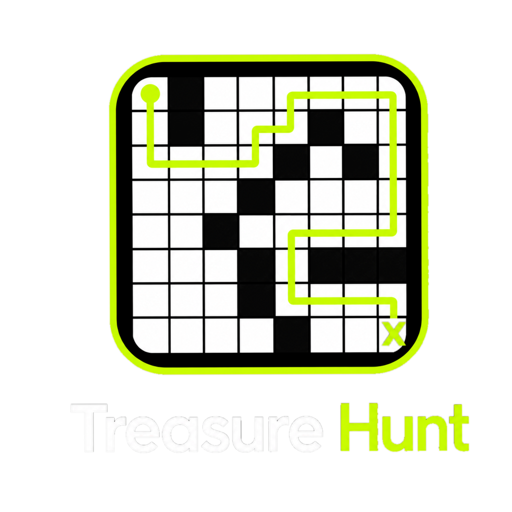

<!--
File: README.md
Document Title: Treasure Hunt Browser Demo Report
Author: Alysha Pursley, Software Developer
Date: June 2026
-->

<div align="center">

# Treasure Hunt Browser Demo Report

### Deep Q-Learning Maze Project Rebuilt as a GitHub Pages Front-End Game



</div>

---

## Table of Contents

- [Project Statement](#project-statement)
  - [Purpose](#purpose)
  - [Project Summary](#project-summary)
    - [Original Concept](#original-concept)
    - [Browser Demo Concept](#browser-demo-concept)
    - [Key Contrast: Original vs Demo](#key-contrast-original-vs-demo)
  - [Scope](#scope)
    - [Included Pages](#included-pages)
    - [Demo Scope](#demo-scope)
    - [Source Scope](#source-scope)
  - [Constraints & Limitations](#constraints--limitations)
    - [Python/Keras Runtime Not Included in GitHub Pages](#pythonkeras-runtime-not-included-in-github-pages)
    - [Browser-Safe Simulation](#browser-safe-simulation)
- [Application Architecture](#application-architecture)
  - [File Structure](#file-structure)
  - [Page Structure](#page-structure)
  - [Asset Structure](#asset-structure)
  - [JavaScript Module Structure](#javascript-module-structure)
- [Gameplay Logic](#gameplay-logic)
  - [Maze Rules](#maze-rules)
  - [Player Rules](#player-rules)
  - [Agent Rules](#agent-rules)
  - [Difficulty Modes](#difficulty-modes)
  - [Randomized Maze Generation](#randomized-maze-generation)
- [Front-End Implementation](#front-end-implementation)
  - [Design System](#design-system)
  - [Logo and Branding](#logo-and-branding)
  - [Accessibility Considerations](#accessibility-considerations)
  - [Browser Compatibility](#browser-compatibility)
- [Running, Testing, and Deployment](#running-testing-and-deployment)
  - [How to Run Locally](#how-to-run-locally)
  - [How to Test the Game](#how-to-test-the-game)
  - [GitHub Pages Deployment](#github-pages-deployment)
  - [Troubleshooting](#troubleshooting)
- [Portfolio Documentation](#portfolio-documentation)
  - [Included Articles](#included-articles)
  - [Case Study](#case-study)
  - [Future Enhancements](#future-enhancements)

---

<div align="center">

# Project Statement

---

### Treasure Hunt Game: Original AI Project, Browser Demo Scope, and Portfolio-Ready Front-End Rebuild

### Report By: Alysha Pursley  
#### *Software Developer*  
#### June 2026

---

**_Project ID: TREASURE-HUNT-FRONTEND-DEMO_**

</div>

---

**Project Type:** Artificial Intelligence Concept Rebuilt as a Static Browser Game  

**Implementation Scope:** HTML, CSS, and JavaScript front-end demo with original Python/Jupyter source preserved for reference.

---

<details open><summary>

## Purpose

</summary>

I built this version of Treasure Hunt to make the original maze-learning project easier to view, test, and understand from a portfolio. The original project focused on an intelligent pirate agent learning how to navigate an 8×8 maze to find treasure. That version was written for a Python and Jupyter Notebook environment, which is useful for development and learning but not ideal for a public portfolio demo.

This browser version keeps the maze, blocked-cell logic, movement rules, treasure goal, and agent behavior concept, then turns the experience into an interactive game a visitor can play directly in the browser. The goal is to make the project feel like a real application while still clearly connecting it back to the original reinforcement-learning concept.

</details>

---

<details open><summary>

## Project Summary

</summary>

### Original Concept

The original Treasure Hunt project used Python, NumPy, Keras, Matplotlib, a custom maze environment, and an experience-replay helper. The agent learned from repeated attempts inside an 8×8 maze. It received rewards for progress, penalties for invalid or inefficient movement, and a win state when it reached the treasure.

### Browser Demo Concept

The front-end demo recreates the player-facing game experience with static browser code. Instead of running a live Keras training process in GitHub Pages, the demo uses JavaScript pathfinding and difficulty settings to simulate an intelligent agent racing the player to the X treasure.

### Key Contrast: Original vs Demo

| Area | Original AI Version | Browser Demo Version |
|---|---|---|
| Runtime | Python/Jupyter/Keras | HTML/CSS/JavaScript |
| Main Goal | Train an agent through reinforcement learning | Let a visitor play against an intelligent agent |
| Hosting | Local machine-learning environment | GitHub Pages |
| Data Storage | Training memory during execution | Browser session only |
| Maze | 8×8 grid | 8×8 randomized grid |
| Agent | Deep Q-learning model | JavaScript behavior inspired by the trained-agent goal |
| User Experience | Developer-focused notebook | Portfolio-ready interactive game |

</details>

---

<details open><summary>

## Scope

</summary>

### Included Pages

- `index.html` — the playable game demo.
- `info.html` — project overview and implementation context.
- `case-study.html` — project conversion case study.
- `article.html` — technical article page.
- `articles.html` — article hub and compare/contrast writing.
- `reflection.html` — public-facing project reflection.

### Demo Scope

The demo is designed to run fully in the browser. It includes randomized mazes, player movement, agent movement, difficulty selection, reward tracking, game logs, and visible race feedback.

### Source Scope

The original Python and notebook files are preserved in `source/original-python/` so the project keeps its technical origin while the public-facing demo remains easy to open and use.

</details>

---

<details open><summary>

## Constraints & Limitations

</summary>

### Python/Keras Runtime Not Included in GitHub Pages

GitHub Pages cannot run Python, Jupyter Notebook, or Keras training code directly. Because of that, the public demo does not attempt to train a neural network live in the browser.

### Browser-Safe Simulation

The front-end version uses JavaScript to recreate the decision-making experience. Hard mode follows a stronger valid route, medium mode adds occasional exploratory behavior, and easy mode gives the player more room to win. The result is honest to the project’s goal without pretending GitHub Pages can run a full machine-learning backend.

</details>

---

<div align="center">

# Application Architecture

</div>

---

<details open><summary>

## File Structure

</summary>

```text
treasure-hunt-demo/
├── index.html
├── info.html
├── case-study.html
├── article.html
├── articles.html
├── reflection.html
├── README.md
├── .nojekyll
├── assets/
│   ├── css/
│   │   └── styles.css
│   ├── js/
│   │   ├── app.js
│   │   ├── q-agent.js
│   │   └── treasure-maze.js
│   └── images/
│       ├── treasure-hunt-logo.png
│       ├── treasure-hunt-mark.svg
│       └── favicon.svg
├── docs/
│   ├── article.md
│   ├── articles.md
│   ├── case-study.md
│   ├── enhanced-browser-demo-article.md
│   ├── original-ai-article.md
│   ├── original-vs-demo-comparison.md
│   ├── portfolio-content.md
│   └── project-reflection.md
└── source/
    ├── README.md
    └── original-python/
        ├── GameExperience.py
        ├── TreasureHuntGame.ipynb
        └── TreasureMaze.py
```

</details>

---

<details open><summary>

## Page Structure

</summary>

The app page is intentionally focused on the playable demo. The supporting writing lives on separate pages so the game page does not feel crowded or like a report pasted under an app. This keeps the project easier to present in a portfolio and easier for a visitor to understand.

</details>

---

<details open><summary>

## Asset Structure

</summary>

The `assets` folder contains the front-end styling, JavaScript modules, and image files. The logo file can be replaced without changing the game logic as long as the path remains the same.

```text
assets/images/treasure-hunt-logo.png
```

</details>

---

<details open><summary>

## JavaScript Module Structure

</summary>

- `treasure-maze.js` handles maze rules, valid movement, randomized board generation, and route checks.
- `q-agent.js` handles the browser-safe intelligent agent behavior and difficulty modes.
- `app.js` connects the interface to the game logic, renders the board, updates HUD values, and manages player input.

</details>

---

<div align="center">

# Gameplay Logic

</div>

---

<details open><summary>

## Maze Rules

</summary>

The maze is an 8×8 grid. Open cells can be crossed. Blocked cells cannot be crossed. The treasure is represented by the X, and the goal is to reach that X before the agent does.

The randomized board generator must preserve three rules:

- The player start cell must be open.
- The treasure cell must be open.
- At least one valid route must exist between the start and treasure.

</details>

---

<details open><summary>

## Player Rules

</summary>

The player can move with keyboard controls or on-screen buttons. The available movement directions are up, down, left, and right. Invalid moves do not move the player, and blocked squares remain blocked.

</details>

---

<details open><summary>

## Agent Rules

</summary>

The agent uses valid open cells only. It does not walk through blocked cells. Its movement is based on route evaluation and difficulty settings so the demo feels like a race rather than a static board.

</details>

---

<details open><summary>

## Difficulty Modes

</summary>

| Mode | Behavior |
|---|---|
| Easy | Slower and less efficient, giving the player more time to win. |
| Medium | Usually follows a strong route but can make exploratory choices. |
| Hard | Plays closer to the shortest valid route and moves more aggressively. |

</details>

---

<details open><summary>

## Randomized Maze Generation

</summary>

Each new game creates a fresh board while still protecting the core gameplay requirement: the board must be solvable. This makes the demo replayable without needing a database or server.

</details>

---

<div align="center">

# Front-End Implementation

</div>

---

<details open><summary>

## Design System

</summary>

The design uses a dark maze-game interface with high-contrast grid cells, neon accent colors, and a focused app layout. The styling supports the treasure/maze theme without burying the actual game under decorative clutter.

</details>

---

<details open><summary>

## Logo and Branding

</summary>

The primary logo is stored in:

```text
assets/images/treasure-hunt-logo.png
```

The current visual direction uses a black background, neon-lime path and border accents, white open cells, dark blocked cells, and the X as the treasure marker.

</details>

---

<details open><summary>

## Accessibility Considerations

</summary>

The page uses visible labels, button controls, keyboard controls, readable contrast, and descriptive page structure. The browser game can be played without needing a mouse because arrow keys and WASD are supported.

</details>

---

<details open><summary>

## Browser Compatibility

</summary>

The demo uses standard HTML, CSS, and JavaScript modules. It is intended for current versions of Chrome, Edge, Firefox, and Safari.

</details>

---

<div align="center">

# Running, Testing, and Deployment

</div>

---

<details open><summary>

## How to Run Locally

</summary>

Open `index.html` directly in a browser, or run a local static server:

```bash
python -m http.server 8000
```

Then open:

```text
http://localhost:8000
```

</details>

---

<details open><summary>

## How to Test the Game

</summary>

1. Open `index.html`.
2. Select Easy, Medium, or Hard.
3. Click **New Maze** several times and confirm the board changes.
4. Click **Start Race**.
5. Move with arrow keys, WASD, or the on-screen buttons.
6. Confirm the player and agent only move through open cells.
7. Confirm the X remains the treasure goal.
8. Confirm the game declares a winner when the player or agent reaches the X.

</details>

---

<details open><summary>

## GitHub Pages Deployment

</summary>

1. Upload the project files to a GitHub repository.
2. Keep `index.html` in the repository root.
3. Keep `.nojekyll` in the repository root.
4. Go to **Settings → Pages**.
5. Choose the branch and root folder.
6. Save and open the published URL.

No build command is required.

</details>

---

<details open><summary>

## Troubleshooting

</summary>

| Issue | Fix |
|---|---|
| Page opens but styling is missing | Check that `assets/css/styles.css` exists and the path is unchanged. |
| Game does not start | Confirm `assets/js/app.js` is loading as a module. |
| Logo does not appear | Confirm `assets/images/treasure-hunt-logo.png` exists. |
| Board looks stretched | Check that `#maze-board` is still styled as an 8×8 CSS grid. |
| GitHub Pages shows a blank page | Make sure all paths are relative and `.nojekyll` is present. |

</details>

---

<div align="center">

# Portfolio Documentation

</div>

---

<details open><summary>

## Included Articles

</summary>

The project includes article-style documentation explaining the original AI implementation, the browser demo version, and the comparison between the two.

</details>

---

<details open><summary>

## Case Study

</summary>

The case study explains how I turned a Python/Jupyter reinforcement-learning project into a playable front-end showcase demo while keeping the public version accurate to the original concept.

</details>

---

<details open><summary>

## Future Enhancements

</summary>

Possible future improvements include animation polish, saved high scores, alternate maze sizes, a visual path replay, and optional localStorage support for player history.

</details>

---

<div align="center">

**Built and maintained by Alysha Pursley**

</div>


---

<details open><summary>

## Original Repository and Source Links

</summary>

The demo pages include an **Original Repository** button and a source-code link. The repository URL currently points to my GitHub profile because the exact original repository URL was not available in this workspace.

Update the original repository URL in the HTML pages after the project repository is created or confirmed.

Current source reference:

```text
source/original-python/
```

</details>
